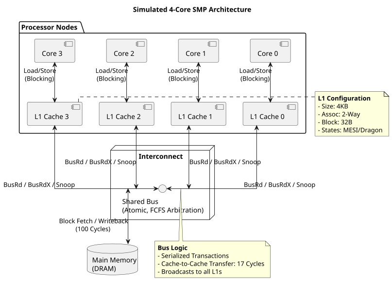
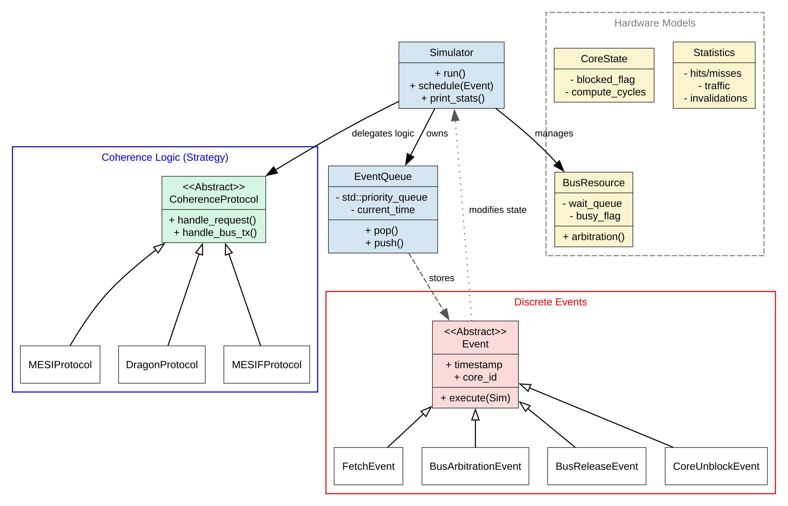
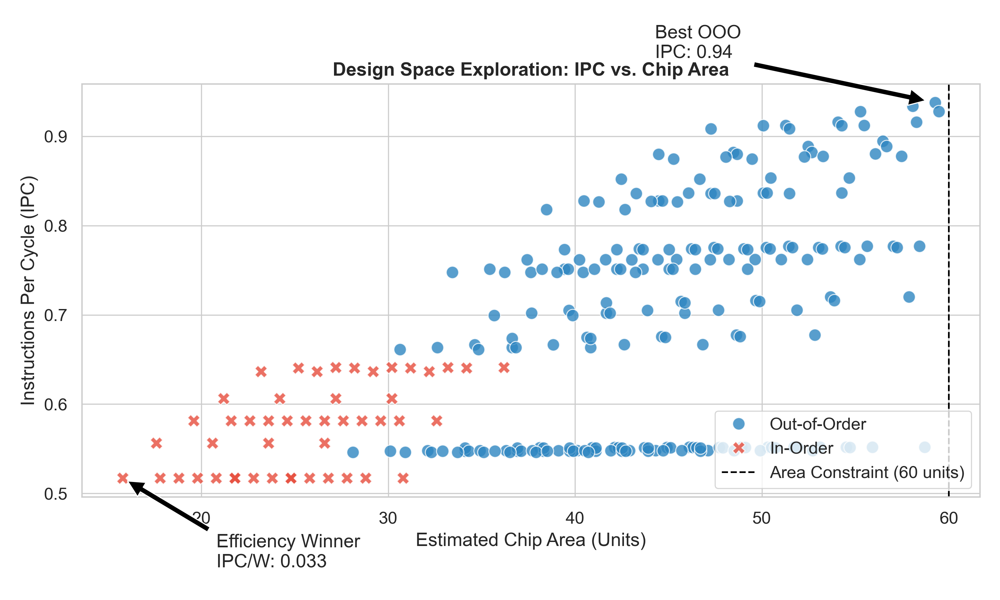
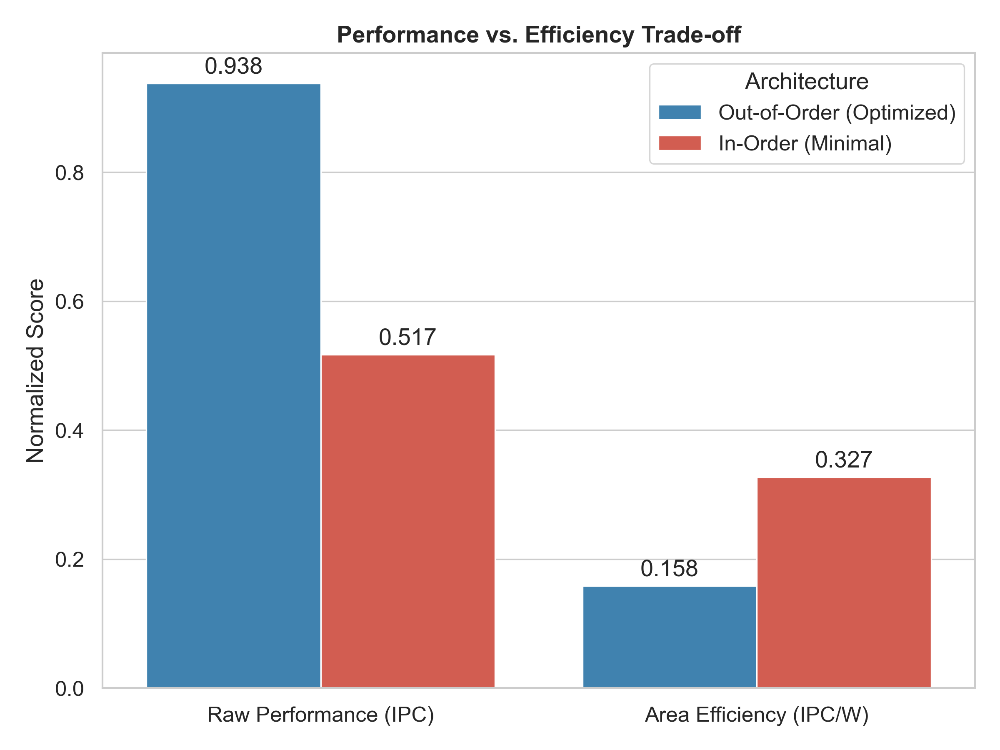
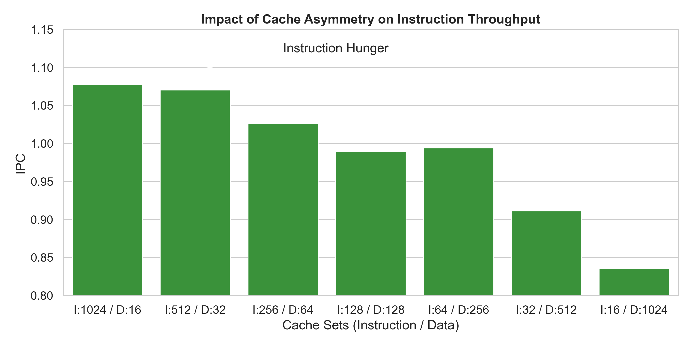

# Advanced Multi-Core Architecture Projects

[]()
[]()
[]()

> **Context:** Systems coursework (CS4223 Multi-Core Architectures) at the National University of Singapore (NUS).

## Overview
This repository contains two systems engineering projects focusing on the hardware-software interface. 
1.  **Cache Coherence Simulator:** A high-performance, trace-driven C++ simulator used to analyze the design space of shared-memory multiprocessing.
2.  **Workload-Aware Microarchitectural Tuning for the Go Benchmark** A design space exploration study maximizing IPC under strict silicon area constraints.

---

## Cycle-Accurate Cache Coherence Simulator

### Objective
To architect a configurable, trace-driven **Discrete-Event Simulator (DES)** capable of modeling memory consistency, bus arbitration, and cache state transitions in a multi-core Symmetric Multiprocessor (SMP) system. This project performs a **Design Space Exploration** across protocols (MESI, Dragon, MOESI, MESIF), cache capacities (1KB–8KB), and arbitration policies.

### System Architecture

#### 1. The Hardware Model
The simulator models a 4-core SMP system with private L1 caches and a shared, atomic bus.
*   **Core Logic:** Blocking cache model (processor stalls on miss).
*   **Interconnect:** Single-channel shared bus with configurable arbitration (FCFS vs. Read-Priority).
*   **Coherence:** Snooping logic with support for Cache-to-Cache transfers (17 cycles) vs. Main Memory fetches (101 cycles).


<p align="center"> Figure 1: The simulated 4-core SMP architecture showing the shared bus bottleneck. </p>

#### 2. The Software Engine (Event-Driven)
Unlike inefficient tick-based simulators that iterate through every clock cycle, this project implements a **Discrete Event Simulation** engine.
*   **Efficiency:** The global clock jumps instantly to the next significant event (e.g., `BusRelease` or `CoreUnblock`), allowing for the simulation of hundreds of millions of cycles in seconds.
*   **Design Patterns:**
    *   **Strategy Pattern:** Encapsulates protocol logic (`MESI`, `Dragon`, `MOESI`) behind a common interface, decoupling the simulation engine from the coherence rules.
    *   **Priority Queue:** Manages the event timeline, resolving race conditions between Bus Arbitration and Instruction Fetching with strict priority levels.


<p align="center"> Figure 2: The Object-Oriented architecture separating the Simulation Engine (Plumbing) from the Protocol Logic (Strategy). </p>

### Key Findings & Analysis

Based on the quantitative analysis of the PARSEC benchmark suite (`blackscholes`, `bodytrack`, `fluidanimate`):

#### 1. The Latency vs. Bandwidth Trade-off
The **Dragon Protocol** (Update-based) consistently outperformed MESI in high-contention workloads (`fluidanimate`), achieving a **1.1% speedup**. However, this performance came at an exorbitant cost:
*   **Traffic Explosion:** Dragon generated **35x more bus traffic** than MESI (124MB vs 3.5MB for *Blackscholes*).
*   **Conclusion:** Dragon effectively trades bandwidth to lower latency (2-cycle updates vs 100-cycle invalidation misses). It is superior only when bus bandwidth is abundant.

#### 2. Resilience to False Sharing
When increasing the block size from 32B to 64B, MESI suffered from False Sharing (ping-ponging invalidations).
*   **Dragon's Advantage:** Dragon proved architecturally robust. By broadcasting fine-grained **word-level updates (4 bytes)**, it decoupled the coherence granularity from the allocation granularity, preventing the traffic spikes seen in MESI.

#### 3. Scheduling Matters: Read-Priority Arbitration
Implementation of a scheduler optimization that prioritizes **Bus Reads (BusRd)** over Writes/Updates in the arbitration queue.
*   **Result:** This yielded a measurable **1.6% speedup** on `bodytrack` (49.5M $\to$ 48.7M cycles).
*   **Insight:** Reads are blocking operations that stall the CPU pipeline, whereas writes are often buffered. By allowing reads to "cut the line," the system unblocks cores faster, offering a "free" performance gain without the hardware cost of complex states like MOESI.

#### 4. The Failure of "Smart" Replacement
Implementation of a **Clean-Preferred Eviction Policy** intended to reduce writeback traffic by prioritizing the eviction of clean lines.
*   **Result:** It successfully reduced writebacks by **33%**.
*   **Impact:** It **degraded performance by ~30%**.
*   **Insight:** "Clean" lines are often "Hot" lines (instructions/constants). Evicting them to save a background writeback penalty caused immediate foreground CPU stalls (Read Misses). **Hit Rate is the single most important metric for performance.**

#### 5. The Coherence Wall
Sensitivity analysis revealed that protocol choice is irrelevant if the cache is undersized.
*   At **1KB cache size**, the system was dominated by capacity thrashing (~258M cycles).
*   Increasing cache to **4KB** (fitting the working set) provided a **10x performance leap** (to ~21M cycles), far outweighing any gains from protocol micro-optimizations.

### 6. Full Report
[Read the Full Research Report](./cache_coherence_protocols_research_PARSEC_benchmarks/Cache-Coherence-Simulator-Report-CS4223.pdf)

---

## Workload-Aware Microarchitectural Tuning for the Go Benchmark


### Abstract
General-purpose processors often allocate significant die area to resources that remain underutilized by specific integer-heavy workloads. This research explores the microarchitectural design space for the **SPEC95** `099.go` **benchmark**, specifically targeting optimal instruction throughput under a strict **60-unit area constraint**. By employing profile-guided optimization and automated design space exploration (DSE), this project achieved a **29% performance increase** over baseline through cache asymmetry and identified a critical efficiency divergence: while Out-of-Order execution maximizes raw IPC, minimal In-Order architectures deliver **2x greater performance-per-watt**.

### 1. Research Methodology
The design process followed a quantitative approach using the **SimpleScalar** simulation suite `(sim-outorder)`. The optimization strategy relied on Amdahl's Law applied to chip area: reducing resources for non-critical paths to reinvest in bottlenecked pipeline stages.

1. **Workload Characterization**: Instruction profiling `(sim-profile)` to map the usage frequency of functional units.
2. **Search Space Pruning**: Theoretical elimination of invalid configurations (e.g., Floating Point Units) to reduce simulation time by **96.8%** (from ~9000 to 288 configs).
3. **Pareto Frontier Analysis**: Evaluating the trade-off curve between Area and Instructions Per Cycle (IPC).
4. **Memory Subsystem Tuning**: Sensitivity analysis of L1 Instruction vs. Data cache sizes.

### 2. Workload Analysis & Pruning
Initial profiling of the go benchmark revealed extreme integer dominance:

- **Floating Point Usage: 0.00%** (20 area units of waste in default superscalar cores).
- **Integer Operations:** Addition (32.6%) vs. Multiplication (0.07%).
- **Memory Intensity:** High load-to-store ratio (2.7:1).

**Optimization Action:** <br>
Based on these metrics, I removed all FPU resources and restricted Integer Multipliers to a single unit. This reclaimed **~35% of the area budget**, allowing for aggressive expansion of the Register Update Unit (RUU) and Load/Store Queue (LSQ).

### 3. Key Findings
**A. Design Space Exploration (IPC vs. Area)**


<p align="center"> Figure 1: The Pareto frontier of processor configurations. The black dashed line represents the physical area constraint. </p>

The exploration revealed that the go benchmark is highly sensitive to instruction window size. Increasing the RUU from 16 to 32 entries yielded the most significant IPC gains for Out-of-Order (OoO) configurations. The optimal OoO design achieved an **IPC of 0.9376** at 59.28 area units.

**B. The Efficiency Paradox (In-Order vs. Out-of-Order)**


<p align="center"> Figure 2: While Out-of-Order provides raw speed, In-Order designs dominate efficiency metrics. </p>

A critical insight from this research is the non-linear relationship between complexity and efficiency.

- **Out-of-Order:** Prioritizes IPC (0.93) but consumes high area for hazard detection and reordering logic.
- **In-Order:** Sacrifices ~45% IPC but reduces area by ~70%.
- **Conclusion:** For power-constrained or embedded environments running go, a minimal In-Order core is superior, offering **0.032 IPC/Watt** vs **0.015 IPC/Watt** for the best OoO core.

**C. Cache Asymmetry**


<p align="center">Figure 3: Impact of L1 Cache partitioning on throughput.</p><br>

Contrary to the "balanced cache" rule of thumb, this workload exhibits a massive preference for Instruction Cache capacity. A configuration skewed heavily toward I-Cache **(1024 sets I-Cache / 16 sets D-Cache)** outperformed balanced configurations by **29%**. This suggests the `go` benchmark suffers primarily from instruction fetch starvation rather than data cache misses.


### 4. Technical Stack
- Simulation: SimpleScalar 3.0 (Alpha ISA)
- Analysis: Python (Pandas, Matplotlib for data visualization)
- Scripting: Bash (Automated batch simulation)
- Metrics: IPC, CPI, Area Cost Models (Transistor equivalent units), Efficiency (IPC/Area).

### 5. Full report
[Read the Full Research Report](./superscalar_pipeline_optimisation_SPEC95_benchmark/Workload-Aware%20Microarchitectural%20Tuning%20for%20the%20Go%20Benchmark.pdf)

---

## Citation
If you find these implementations useful for reference, please cite:

```bibtex
@misc{ramanathan2025microarch,
  author = {Alagappan Ramanathan},
  title = {Workload-Specific Microarchitectural Tuning and Cache Asymmetry Analysis},
  year = {2025},
  note = {Cache Coherence Simulator & Design Space Exploration Case Study Discrete-Event Simulator (DES)},
  url = {https://github.com/AlagappanRa/Advanced-Multicore-Architecture-Projects}
}
